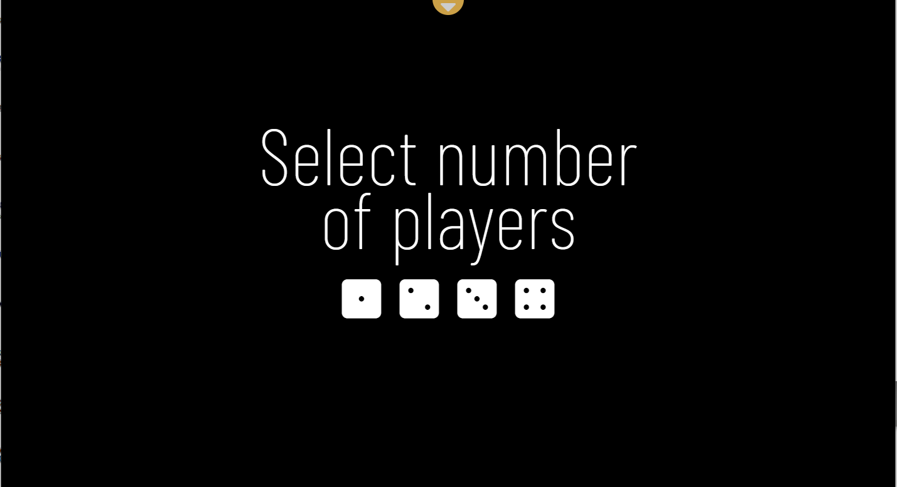
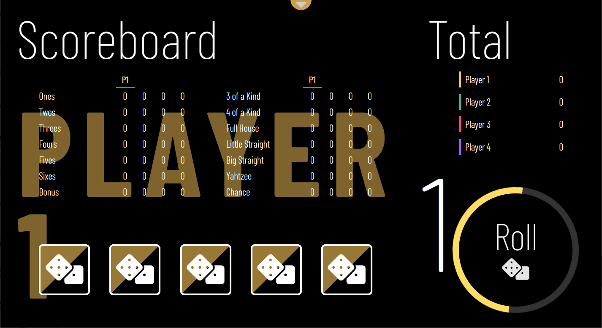
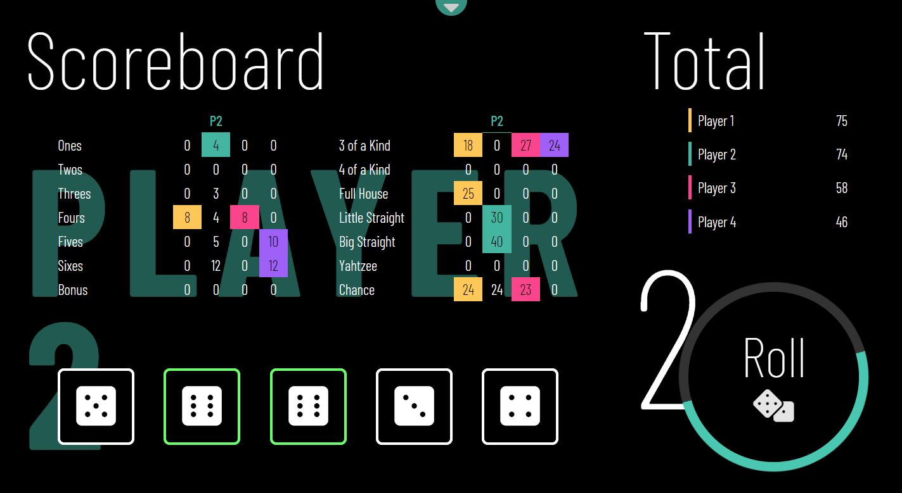
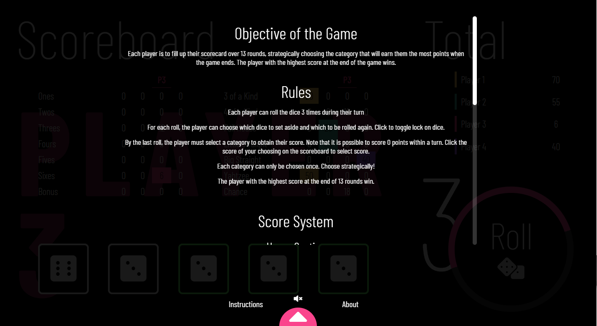
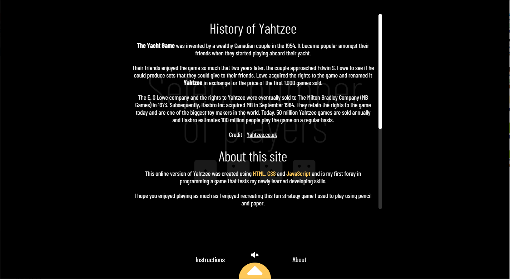

# Yahtzee - First Project

This project is intended to recreate the classic Yahtzee strategy game for up to 4 players with a simple 'night-mode' design.

[Live Site](https://reverent-pasteur-30c395.netlify.app "Yahtzee Game - vkwho9ar")

---

## Screenshots

View more images in **screenshots** folder.

---

## How to Play

_Note that the descriptions below are available in game_

To learn the rules of Yahtzee:

-  visit the [Dice Game Depot](https://www.dicegamedepot.com/yahtzee-rules/) site
-  watch [How to Play Yahtzee](https://www.youtube.com/watch?v=AHDgpuEzopc)

To execute actions:

-  To roll - click the circular Roll button
-  Set aside dice - click to toggle lock on individial dice cards. Locked dice are highlighted in green.
-  Select score - non-highlighted scores on the scoreboard can be clicked to select. Highlighted scores are already selected and cannot be chosen again.
-  Open menu - click the top semi-circle button to toggle menu which includes options for instructions, sound, and details about the game.

---

### The purpose of this project is to learn and gain practice with:

-  HTML, CSS, JavaScript
-  Using Git and Github
-  Set goals and create own project schedule
-  Mass googling, debugging, commenting and clean code

---

### Built with:

-  HTML, CSS, JavaScript
